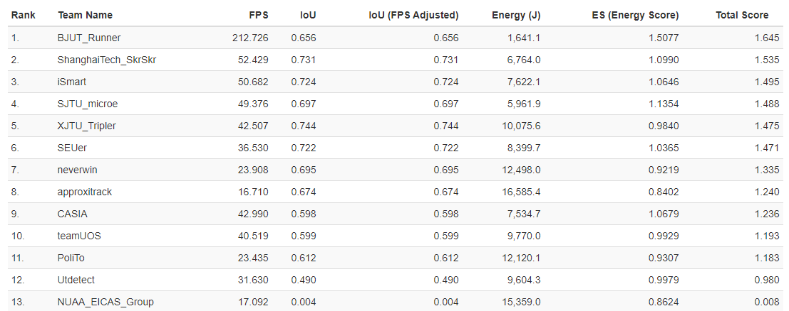
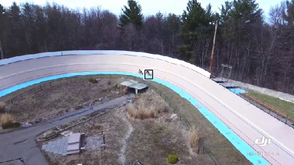
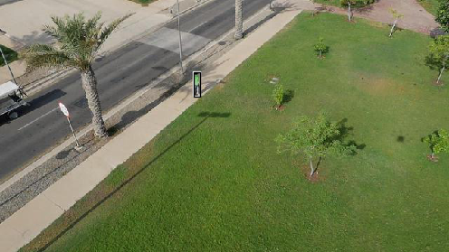
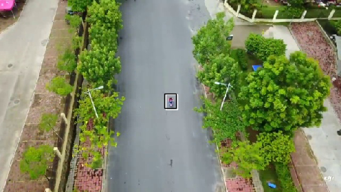

# Ultra_net : A FPGA-based Object Detection for the DAC-SDC 2020

This is a repository for FPGA-based neural network inference. The design won first place in the 56th IEEE/ACM Design Automation Conference System Design Contest (DAC-SDC).

The final rankings are published at https://dac-sdc-2020.groups.et.byu.net/doku.php?id=results

